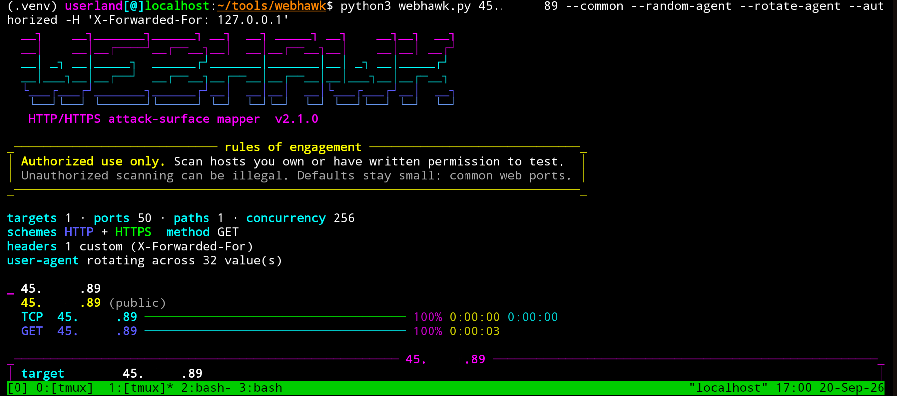

<p align="center">
  
</p>

# WebHawk

**Version 2.1.0** — HTTP/HTTPS attack-surface mapper for **authorized** assessments.

WebHawk finds ports that actually speak HTTP or HTTPS, fingerprints what is
listening, and can write live URLs plus page source to disk. It is meant for
lab boxes, your own servers, and scoped engagements — not for scanning the
internet.

```bash
python webhawk.py 127.0.0.1 lab.local
python webhawk.py -l targets.txt --save-urls live.txt --save-source pages/
python webhawk.py 127.0.0.1 --user-agent agents.txt --paths paths.txt -H headers.txt
```

## Preview


## Rules of engagement

Only run WebHawk against systems you own or have **written permission** to
test. Unauthorized port scanning and web probing can be illegal.

Defaults stay small on purpose:

- common web ports only (80, 443, 8080, 8443, …)
- no full 1–65535 sweep unless you pass `--all --authorized`
- CIDRs larger than `/24` (256 hosts) also require `--authorized`
- hard cap of 1024 expanded CIDR hosts
- `--skip-tcp` on more than 1024 ports also requires `--authorized`

`--i-own-this` is still accepted as an alias for `--authorized`.

## Install

Python 3.10+ recommended.

```bash
python -m venv .venv
source .venv/bin/activate          # Windows: .venv\Scripts\activate
pip install -r requirements.txt
chmod +x webhawk.py
python webhawk.py --version
```

Dependencies (see `requirements.txt`):

- `rich` — colored terminal UI
- `httpx` — async HTTP client

## Project files

| File | Purpose |
| --- | --- |
| `webhawk.py` | The scanner |
| `requirements.txt` | Python dependencies |
| `targets.example.txt` | Sample host list |
| `agents.example.txt` | Sample User-Agent list |
| `paths.example.txt` | Sample path list |
| `headers.example.txt` | Sample custom headers |
| `http_port_probe.py` | Compatibility wrapper that calls WebHawk |

## Quick start

```bash
# Single host, common web ports, HTTP + HTTPS
python webhawk.py 127.0.0.1

# Several hosts on the command line
python webhawk.py 127.0.0.1 localhost lab.internal

# Target list file (# comments and blank lines ignored)
python webhawk.py -l targets.txt --ports 80,443,8080,8443

# Save live URLs and response bodies
python webhawk.py 127.0.0.1 --ports 80,8765 \
    --save-urls live.txt \
    --save-source pages/ \
    --save-headers headers/

# One folder for every artifact
python webhawk.py 127.0.0.1 --ports 80,443 --output-dir ./hawk-out
```

## How a scan works

1. Resolve each host and label addresses as loopback / private / public.
2. Asynchronous TCP connect scan of the selected ports (unless `--skip-tcp`).
3. For every open port, send the chosen method over HTTP and/or HTTPS for each path.
4. Classify the response: status, `Server` / `X-Powered-By`, HTML title, body snippet, tags.
5. On HTTPS, pull TLS version, subject, issuer, and expiry.
6. Stream artifacts to disk as live URLs are found.

Closed ports never get an HTTP request unless you pass `--skip-tcp`.

## Features

| Area | What you get |
| --- | --- |
| Targets | Multiple hosts, `-l` target file, small CIDR ranges |
| Ports | Common web list, `--ports`, `--ports-file`, `--range`, `--all`, `--exclude-ports` |
| Protocols | HTTP, HTTPS, or both; optional redirect following; `--skip-tcp` |
| Paths | Comma list or file; a leading `/` is added when missing |
| Headers | Repeatable `-H 'Name: value'` and `--headers-file` |
| User-Agents | String, file, `--random-agent`, `--rotate-agent`, built-in silly pool |
| Methods | `GET` (default), `HEAD`, `OPTIONS`, `POST` |
| Auth | `--auth USER:PASS` (HTTP Basic) |
| Fingerprints | Server header, `X-Powered-By`, HTML title, known panels |
| Tags | `dir-listing`, `default-page`, `auth-required`, `forbidden`, `expired-cert`, product names |
| TLS | Protocol version, CN/O, issuer, notAfter, SAN, expiry flag |
| Filters | `--status 200,401`, `--grep admin`, `--only-live` |
| Artifacts | Live URL list, page source, header dumps, JSON, CSV, `--output-dir` |
| Hygiene | Timeouts, retries, concurrency cap, `--delay`, `--proxy` |
| Safety rails | `--authorized` for wide port or CIDR sweeps |

Panel / stack tags currently include Grafana, Kibana, Jenkins, phpMyAdmin,
Tomcat, WebLogic, Webmin, Prometheus, Portainer, Nginx, Apache, IIS, Caddy,
Traefik, MinIO, RabbitMQ, CouchDB, Elasticsearch, SonarQube, GitLab,
Nextcloud, WordPress, and Drupal — matched against title, server, and body.

## Artifact output

### Live URLs (`--save-urls FILE`)

One URL per line, appended, de-duplicated. Suitable as input to other tools:

```
http://127.0.0.1:8765/
https://lab.internal:8443/robots.txt
```

### Page source (`--save-source DIR`)

Each live response body is written under `DIR` with a stable name:

```
pages/127.0.0.1_8765_http_root.html
pages/lab.internal_8443_https_robots.txt.txt
```

Extension is chosen from `Content-Type` / body sniffing (`.html`, `.json`,
`.xml`, `.js`, `.css`, `.txt`, `.bin`). Bodies are truncated to `--max-body`
(default 256 KiB).

### Headers (`--save-headers DIR`)

Interesting headers only (`Server`, `X-Powered-By`, security headers,
`WWW-Authenticate`, other `X-*`).

### Reports

- `--json report.json` — full machine-readable result (no raw bodies)
- `--csv report.csv` — one row per live hit
- `--output-dir DIR` — writes `live.txt`, `pages/`, `headers/`, `webhawk.json`, and `webhawk.csv`

## CLI reference

```
usage: webhawk.py [options] [targets ...]
```

### Targets

| Flag | Meaning |
| --- | --- |
| `targets` | IPs, hostnames, URLs, or CIDR (e.g. `10.0.0.0/30`) |
| `-l FILE`, `--targets-file FILE` | Load extra targets from a file |

### Port selection

| Flag | Meaning |
| --- | --- |
| `--common` | Built-in web ports (default) |
| `--ports SPEC` | `80,443,8000-8010` |
| `--range START-END` | Inclusive range |
| `--all` | 1–65535; requires `--authorized` |
| `--ports-file FILE` | Port specs, one per line |
| `--exclude-ports SPEC` | Drop ports from the selected set |
| `--authorized` | Required for `--all`, ranges > 4096 ports, CIDRs > 256 hosts. Alias: `--i-own-this` |
| `--skip-tcp` | Do not SYN-scan; send HTTP(S) to every selected port |

### Request shape

| Flag | Meaning |
| --- | --- |
| `--paths SPEC` | Comma-separated paths **or** a paths file. Missing `/` is prepended |
| `--paths-file FILE` | Paths, one per line (`#` comments ok) |
| `--method GET\|HEAD\|OPTIONS\|POST` | Request method (default `GET`) |
| `--http-only` / `--https-only` | Restrict scheme |
| `--follow-redirects` | Follow 3xx |
| `--insecure` | Skip TLS verification |
| `--no-cert` | Skip certificate metadata |
| `--host-header NAME` | Force `Host` (vhost on a raw IP) |
| `-H HEADER`, `--header HEADER` | Custom `Name: value` (repeatable) **or** a headers file |
| `--headers-file FILE` | Custom headers, one `Name: value` per line |
| `--auth USER:PASS` | HTTP Basic auth |
| `--user-agent STR` | Custom UA **or** a file of UAs |
| `--user-agents-file FILE` | User-Agents, one per line |
| `--random-agent` | One random UA from the pool for the whole scan |
| `--rotate-agent` | A new random UA from the pool on every request |
| `--proxy URL` | Send traffic through an HTTP proxy |
| `--concurrency N` | Parallel TCP connects (default 256) |
| `--connect-timeout S` | TCP timeout (default 1.2) |
| `--http-timeout S` | HTTP timeout (default 4.0) |
| `--retries N` | Retry timeout/connect failures |
| `--delay S` | Sleep before each probe |
| `--max-body N` | Max saved body bytes (default 262144) |

### Filtering and output

| Flag | Meaning |
| --- | --- |
| `--status 200,301-302,401` | Live-hit allow-list |
| `--grep REGEX` | Title / body / server must match |
| `--only-live` | Hide TCP-open ports with no HTTP(S) |
| `--save-urls FILE` | Append live URLs |
| `--save-source DIR` | Dump response bodies |
| `--save-headers DIR` | Dump interesting headers |
| `--output-dir DIR` | Shortcut for live.txt + pages/ + headers/ + JSON + CSV |
| `--json FILE` | JSON report |
| `--csv FILE` | CSV report |
| `--quiet` | No ASCII banner |
| `--version` | Print version |

## List file formats

Blank lines and lines starting with `#` are ignored.

`targets.txt`

```
# lab web tier
127.0.0.1
localhost
# staging
10.0.0.10
app.internal.example
```

URLs are accepted; the scheme and path are ignored and the hostname is used.

`paths.txt`

```
/
robots.txt
admin
/login
```

`admin` becomes `/admin` automatically.

`agents.txt`

```
WebHawk/2.1 (coffee-powered)
Mozilla/4.0 (PSP (PlayStation Portable); 2.00)
```

`headers.txt`

```
Accept-Language: en-US,en;q=0.8
X-Forwarded-For: 127.0.0.1
```

`ports.txt`

```
80
443
8000-8010
8443
```

## Examples

Scoped lab box, export everything useful:

```bash
python webhawk.py 127.0.0.1 \
    --ports 80,443,8000,8080,8443,8765 \
    --paths /,/robots.txt \
    --save-urls live.txt \
    --save-source pages/ \
    --save-headers headers/ \
    --json webhawk.json \
    --csv webhawk.csv
```

Several named vhosts on one IP:

```bash
python webhawk.py 10.0.0.8 --ports 80,443 --host-header app.example.internal --insecure
```

Only show interesting failures / admin surfaces:

```bash
python webhawk.py -l targets.txt --status 200,401,403 --grep "admin|login|grafana"
```

Gentle scan through an intercepting proxy:

```bash
python webhawk.py 127.0.0.1 --ports 80,443 --delay 0.05 --proxy http://127.0.0.1:8080
```

Custom headers, path list, and a User-Agent file:

```bash
python webhawk.py 127.0.0.1 --ports 8765 --http-only \
    --user-agent agents.example.txt --rotate-agent \
    --paths paths.example.txt \
    -H "X-Lab: 1" \
    --headers-file headers.example.txt
```

Skip the TCP connect scan and only speak HTTP/HTTPS:

```bash
python webhawk.py 127.0.0.1 --ports 80,443,8080 --skip-tcp --only-live
```

Dump everything into one folder:

```bash
python webhawk.py 127.0.0.1 --ports 80,443 --output-dir ./hawk-out
```

Full-port sweep of a machine you own (slow, noisy):

```bash
python webhawk.py 127.0.0.1 --all --authorized --only-live --save-urls live.txt
```

## Exit codes

| Code | Meaning |
| --- | --- |
| 0 | Finished |
| 2 | Bad arguments / safety rail tripped |
| 130 | Interrupted with Ctrl-C |

DNS failures on one host do not abort the rest of the list.

## Limitations

- This is an HTTP speaker check, not a general-purpose port scanner. Non-HTTP
  services on an open port are reported as “TCP open, no HTTP”.
- `--all` is tens of thousands of TCP connects. Use it only on hosts you control.
- `--skip-tcp` sends an HTTP(S) request to every selected port, including closed
  ones. Keep the port set small.
- Page source is whatever the server returned for the requested path, truncated
  to `--max-body`. It is not a site crawl.
- TLS metadata uses a separate handshake with hostname verification disabled
  for collection; `--insecure` only affects the HTTP client.

## License / use

Provided as-is for defensive and authorized testing. You are responsible for
staying inside your scope and local law.
